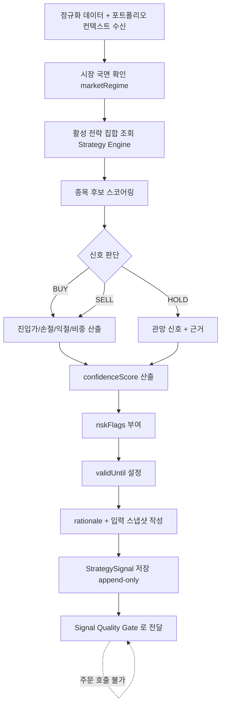

# AI_TRADER_FLOW — AI 트레이더 흐름

> AI 트레이더의 입력, 신호 생성 절차, 출력 형식, 품질 검증을 정의한다.
> **AI는 신호만 생성한다. 증권사 주문 API를 직접 호출하지 않는다.**

관련: [END_TO_END_FLOW](END_TO_END_FLOW.md) · [STRATEGY_SELECTION_FLOW](STRATEGY_SELECTION_FLOW.md) ·
[RISK_ENGINE_RULES](RISK_ENGINE_RULES.md) · [DATA_MODEL](DATA_MODEL.md)

---

## 1. 입력 데이터

| 범주 | 항목 |
| --- | --- |
| 시장 데이터 | 가격, 거래량, 호가, 변동성 |
| 기술 지표 | 이동평균, RSI, MACD, 볼린저밴드, ATR, 모멘텀 등 |
| 지수 | 시장 지수, 업종(섹터) 지수 |
| 종목 이력 | 종목별 과거 성과 |
| 포트폴리오 | 포트폴리오 구성, 보유 종목 손익, 현금 및 주문 가능 금액 |
| 전략 | 전략별 과거 성과 |
| 국면 | 시장 국면 정보(marketRegime) |
| 뉴스/이벤트 | 뉴스·공시·이벤트 정보 — **사용 가능하나 출처(source)와 시점(observedAt)을 반드시 기록** |

### 1.1 입력 처리 규칙

- 모든 입력은 **정규화된 요약**으로 주입한다(원천은 Market Data Service 책임).
- 뉴스/공시/이벤트는 `source`, `observedAt`, `publishedAt`을 함께 저장한다(미래 정보 누설/룩어헤드 방지).
- 신호 생성에 사용한 입력의 **스냅샷**(`signalInputSnapshot`)을 저장한다(재현·감사).
- **비밀정보(키/토큰/계좌번호)·개인 식별정보는 입력 요약에 포함하지 않는다.**

---

## 2. 신호 생성 흐름 (Mermaid)



> AI 흐름 어디에도 Broker/Execution 호출이 없다(구조적 분리).

---

## 3. 출력 형식 (StrategySignal)

```json
{
  "strategySignalId": "uuid",
  "signalType": "BUY | SELL | HOLD",
  "symbol": "005930",
  "confidenceScore": 74,
  "recommendedPositionSizePercent": 5.0,
  "entryPriceRange": { "min": 71000, "max": 72500 },
  "stopLossPrice": 68500,
  "takeProfitPrice": 78000,
  "holdingPeriod": "INTRADAY | SWING | POSITION",
  "validUntil": "2026-06-25T15:20:00+09:00",
  "strategyId": "momentum-v3",
  "marketRegime": "BULL | BEAR | SIDEWAYS | HIGH_VOLATILITY | EVENT",
  "rationale": "RSI 과매도 + 지지선 근접, 섹터 비중 여유. 근거 데이터 요약 포함.",
  "riskFlags": ["NEAR_EARNINGS", "ELEVATED_VOLATILITY"],
  "signalCreatedAt": "2026-06-25T09:35:00+09:00",
  "inputSnapshotRef": "snapshot-uuid"
}
```

### 3.1 필드 규칙

| 필드 | 규칙 |
| --- | --- |
| `signalType` | BUY/SELL/HOLD 외 불가 |
| `confidenceScore` | 정수 0~100. 자동/거절 임계는 Risk Engine·Order Policy가 적용 |
| `recommendedPositionSizePercent` | **권장값**일 뿐, 최종 비중은 포트폴리오 한도·Risk Engine이 우선 |
| `entryPriceRange` | min ≤ max. 시장가 신호는 별도 플래그 |
| `stopLossPrice`/`takeProfitPrice` | BUY는 stop < entry < takeProfit 정합성 검증 |
| `holdingPeriod` | 보유 예상 기간(유형 또는 기간) |
| `validUntil` | 만료 시각. 경과 시 무효 |
| `riskFlags` | 주의 신호(실적 임박/고변동성/유동성 등). Order Policy가 승인 전환에 활용 |
| `rationale` | 사람이 읽을 근거. **반드시 저장** |
| `signalCreatedAt` | 신호 생성 시각 |

---

## 4. 신호 품질 검증 (Signal Quality Gate, 6단계)

신호는 포트폴리오 영향 분석 전에 다음을 통과해야 한다.

| 검사 | 실패 시 |
| --- | --- |
| 만료 검사 (`validUntil` 경과) | 폐기(SIGNAL_EXPIRED) |
| 신뢰도 검사 (거절 임계 미만) | 폐기(LOW_CONFIDENCE) |
| 정합성 검사 (stop/entry/takeProfit, 비중 범위) | 폐기(INCONSISTENT_SIGNAL) |
| 중복 검사 (동일 종목·방향·미체결 존재) | 폐기(DUPLICATE_SIGNAL) |
| 데이터 신선도 검사 (입력 지연/결측) | 폐기 또는 보류(STALE_DATA) |
| 종목 상태 사전 검사 (정지/관리 등) | 폐기(SYMBOL_NOT_TRADABLE) |

통과한 신호만 [Portfolio Impact Analyzer](PORTFOLIO_MANAGEMENT_RULES.md)로 전달된다.

---

## 5. 금지 사항

- 증권사 주문/취소 API 직접 호출 ❌
- 위험 한도 우회·한도 변경 요청 ❌
- 승인되지 않은 전략의 즉흥 실행 ❌
- 비밀정보·개인정보의 입력/출력/로그 포함 ❌
- 뉴스/이벤트 정보를 출처·시점 기록 없이 사용 ❌
