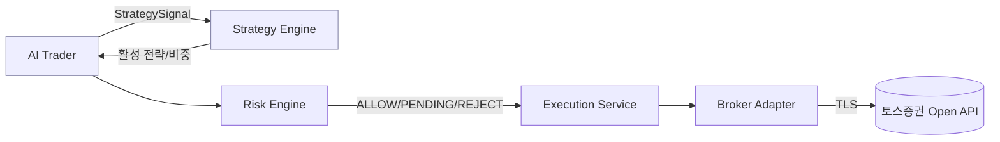

# COMPONENT_RESPONSIBILITIES — 컴포넌트 책임 분리

> 각 컴포넌트의 **할 수 있는 것 / 절대 못 하는 것**을 명시한다.
> 핵심: 신호 생성 / 위험 검증 / 주문 실행 / 증권사 호출을 물리적으로 분리한다.

관련: [END_TO_END_FLOW](END_TO_END_FLOW.md) · [ORDER_LIFECYCLE](ORDER_LIFECYCLE.md) · [RISK_ENGINE_RULES](RISK_ENGINE_RULES.md)

---

## 1. 책임 경계 요약

| 컴포넌트 | 핵심 책임 | 주문 호출 |
| --- | --- | --- |
| AI Trader | 시장 분석, 신호·권장 비중 생성 | ❌ 불가 |
| Strategy Engine | 국면 판단, 전략 선택/비중/성과 | ❌ 불가 |
| Risk Engine | 검증·한도·Kill Switch·판정 | ❌ 불가(판정만) |
| Execution Service | 주문 생성·전송·상태 동기화 | ⭕ Adapter 통해서만 |
| Broker Adapter | 증권사 API 호출·인증·토큰 | ⭕ **유일한 호출 지점** |

---

## 2. AI Trader

**할 수 있는 것**
- 입력 분석, `StrategySignal`(BUY/SELL/HOLD + 신뢰도/비중/진입·손절·익절/유효기간/riskFlags/근거) 생성
- 입력 스냅샷·근거 저장

**절대 못 하는 것**
- 증권사 주문/취소 호출, 잔고 변경
- 위험 한도 우회·변경
- 승인되지 않은 전략 실행

> 빌드 의존성에 Broker SDK/Execution을 포함하지 않는다(컴파일 단계 차단).

---

## 3. Strategy Engine

**할 수 있는 것**
- 시장 국면 판단, 승인된 전략 풀에서 활성 전략·상한 비중 산출
- 전략 성과 지표 누적, 비활성화/비중 조정 결정, Strategy Kill Switch 트리거

**절대 못 하는 것**
- 신호의 임의 실행, 주문 호출
- 거버넌스 미승격 전략의 실거래 투입

---

## 4. Risk Engine (+ Order Policy)

**할 수 있는 것**
- 주문 후보·포트폴리오 결정 검증, 한도/중복/빈도/시간/종목상태/Kill Switch 판정
- `ALLOW` / `PENDING_APPROVAL` / `REJECT` 결정과 위반 항목 기록

**절대 못 하는 것**
- 신호 생성, 주문 직접 전송
- 검증 우회(검증은 항상 필수)

상세 규칙: [RISK_ENGINE_RULES](RISK_ENGINE_RULES.md)

---

## 5. Execution Service

**할 수 있는 것**
- `ALLOW`된(또는 승인된) 주문만 생성(CREATED)·전송(SUBMITTED)
- 멱등키 관리, 체결/부분체결/취소 상태 동기화, 결과 저장
- 타임아웃·재시도·서킷브레이커 적용

**절대 못 하는 것**
- 위험 검증 우회, 미승인 PENDING 주문 전송
- 증권사 자격증명 직접 보유(Adapter에 위임)

상세: [ORDER_LIFECYCLE](ORDER_LIFECYCLE.md) · [FAILURE_AND_RECOVERY](FAILURE_AND_RECOVERY.md)

---

## 6. Broker Adapter

**할 수 있는 것**
- 토스증권 Open API 호출(주문/취소/잔고/포지션 조회)
- 인증 토큰 주입·회전(메모리/단명 캐시), 응답을 내부 DTO로 변환

**절대 못 하는 것**
- 위험 검증 없이 자체 주문 판단
- 자격증명·토큰을 로그·DB·외부 응답에 노출

> ⚠️ 토스증권 API 실제 스펙(엔드포인트/필드/인증)은 공식 문서 확정 전 추측·하드코딩하지 않는다.
> Adapter는 내부 인터페이스(`placeOrder/cancelOrder/getBalance/getPositions`)만 고정한다.

---

## 7. 지원 컴포넌트

| 컴포넌트 | 책임 |
| --- | --- |
| Market Data Service | 수집·정규화·적재·캐시, 데이터 품질 플래그 |
| Portfolio Service | 포지션·현금·비중·평가손익 집계, 잔고 재동기화 |
| Audit/Signal Store | 신호·주문·감사 분리 저장(append-only) |
| Observability | 메트릭·알림·대시보드, Kill Switch 상태 노출 |
