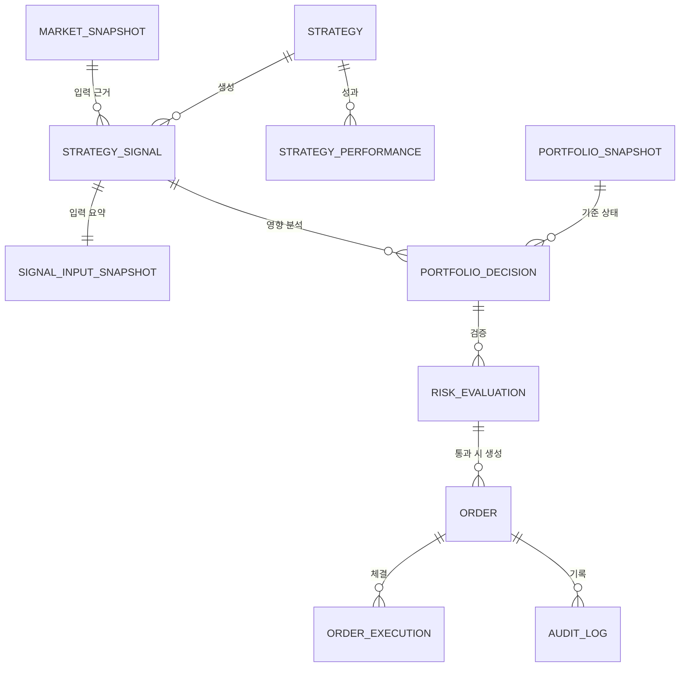

# DATA_MODEL — 데이터 모델 및 추적 구조

> 핵심 엔터티와 **추적 식별자 체인**(correlationId / strategySignalId / portfolioDecisionId / orderId)을 정의한다.
> 신호와 주문 결과는 분리 저장한다.

관련: [END_TO_END_FLOW](END_TO_END_FLOW.md) · [ORDER_LIFECYCLE](ORDER_LIFECYCLE.md) · [EVENT_FLOW](EVENT_FLOW.md)

---

## 1. 추적 식별자 체인

```
correlationId   : 한 수집~판단~주문~체결 사이클 전체를 관통하는 추적 ID
  └ strategySignalId : AI 신호 단위
      └ portfolioDecisionId : 포트폴리오 영향 분석 결과 단위
          └ orderId : 실제 주문 단위 (여러 주문/분할 가능)
```

- 모든 로그·이벤트·감사 레코드에 `correlationId`를 필수 포함한다.
- 하위 ID는 상위 ID를 참조(FK)하여 역추적 가능해야 한다.

---

## 2. 엔터티 관계 (Mermaid)



---

## 3. 핵심 엔터티

### strategy_signal (AI 신호, append-only)
| 필드 | 타입 | 비고 |
| --- | --- | --- |
| strategySignalId (PK) | uuid | |
| correlationId | uuid | 추적 |
| signalType | enum | BUY/SELL/HOLD |
| symbol | string | |
| confidenceScore | int | 0~100 |
| recommendedPositionSizePercent | decimal | 권장값 |
| entryPriceMin / entryPriceMax | int | |
| stopLossPrice / takeProfitPrice | int | |
| holdingPeriod | enum/string | |
| validUntil | datetime | |
| strategyId | string | |
| marketRegime | enum | |
| rationale | text | 근거 저장 필수 |
| riskFlags | json | |
| signalCreatedAt | datetime | |
| inputSnapshotRef | uuid | → signal_input_snapshot |

### signal_input_snapshot (재현용 입력 요약)
- 가격/지표/지수/포트폴리오/전략성과/국면 요약, 뉴스·공시는 `source`/`observedAt`/`publishedAt` 포함.
- **비밀정보·개인정보 미포함.**

### portfolio_decision
| 필드 | 비고 |
| --- | --- |
| portfolioDecisionId (PK), correlationId, strategySignalId (FK) | |
| symbol, side, targetQuantity, targetPositionPercent | |
| expectedPositionPct / sectorPct / strategyPct / cashReservePct | 사후 예상 비중 |
| decidedAt | |

### risk_evaluation
| 필드 | 비고 |
| --- | --- |
| evaluationId (PK), portfolioDecisionId (FK), correlationId | |
| result | ALLOW / PENDING_APPROVAL / REJECT |
| violations | json `[{rule,limit,actual}]` |
| killSwitch | OFF/GLOBAL/STRATEGY/SYMBOL |
| evaluatedAt | |

### order (실제 주문, 신호와 분리)
| 필드 | 비고 |
| --- | --- |
| orderId (PK), correlationId, strategySignalId, portfolioDecisionId | 추적 체인 |
| symbol, side, quantity, orderType, limitPrice | |
| mode | PAPER/SEMI_AUTO/AUTO |
| status | CREATED…FAILED ([ORDER_LIFECYCLE](ORDER_LIFECYCLE.md)) |
| idempotencyKey | candidateId 기반 |
| createdAt / updatedAt | |

### order_execution (체결)
| 필드 | 비고 |
| --- | --- |
| executionId (PK), orderId (FK), correlationId | |
| filledQuantity, avgFillPrice, fee, tax | 거래비용 |
| brokerOrderRef | 마스킹/민감 제외 |
| executedAt | |

### strategy_performance
- 누적수익률, MDD, 승률, 손익비, 샤프(또는 대체), 거래횟수, **거래비용 반영 수익률**, 구간(window).

### portfolio_snapshot / position
- 현금, 주문가능금액, 종목별 평가금액·손익, 섹터/전략 비중, 현금보유비율.

### audit_log (append-only)
- 주문/한도변경/KillSwitch/모드변경/전략 상태변경/인증 이벤트, `correlationId` 포함.

---

## 4. 저장 원칙

- 신호(`strategy_signal`)와 주문(`order`/`order_execution`)은 **분리 테이블**.
- 감사/신호는 **append-only**(수정 불가). 보정은 새 레코드로.
- 시각은 UTC 저장, 표시 KST. 금액 정수(KRW), 비율 decimal.
- 비밀정보·계좌번호·토큰은 어떤 테이블에도 저장하지 않는다.
