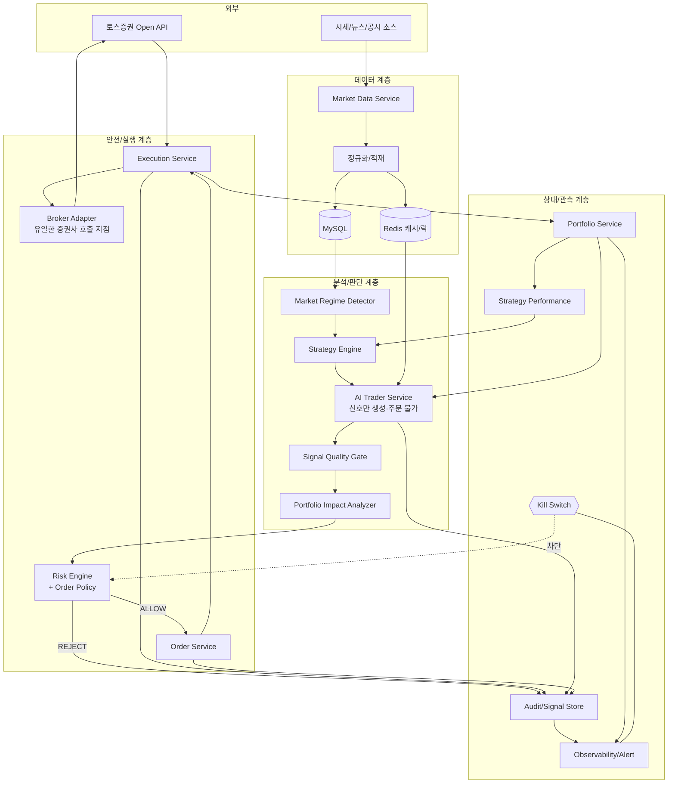
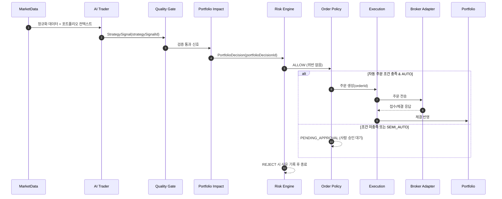

# END_TO_END_FLOW — 전체 업무 흐름

> 본 문서는 AI 자동매매 플랫폼의 **데이터 수집 → 신호 → 검증 → 주문 → 체결 → 성과 평가 → 복구**까지의
> 전체 흐름을 정의하는 마스터 문서다. 세부 흐름은 각 하위 문서를 참조한다.
> 공통 규칙·보안 정책·위험 관리 정책은 이미 존재한다고 가정한다.

**핵심 불변식**
- AI는 시장을 분석하고 신호와 권장 비중을 **제안**한다. 그러나 **증권사 주문 API를 직접 호출하지 않는다.**
- AI 신호는 **Risk Engine + Order Policy**를 통과한 경우에만 **자동 주문** 또는 **승인 대기 주문**으로 전환된다.
- 수익률이 높아도 위험 한도를 초과하면 주문하지 않는다.

관련 문서: [AI_TRADER_FLOW](AI_TRADER_FLOW.md) · [STRATEGY_SELECTION_FLOW](STRATEGY_SELECTION_FLOW.md) ·
[COMPONENT_RESPONSIBILITIES](COMPONENT_RESPONSIBILITIES.md) · [ORDER_LIFECYCLE](ORDER_LIFECYCLE.md) ·
[RISK_ENGINE_RULES](RISK_ENGINE_RULES.md) · [PORTFOLIO_MANAGEMENT_RULES](PORTFOLIO_MANAGEMENT_RULES.md) ·
[FAILURE_AND_RECOVERY](FAILURE_AND_RECOVERY.md) · [DATA_MODEL](DATA_MODEL.md) ·
[EVENT_FLOW](EVENT_FLOW.md) · [OBSERVABILITY](OBSERVABILITY.md) · [DEPLOYMENT_GUIDE](DEPLOYMENT_GUIDE.md)

---

## 1. 시스템 아키텍처 (Mermaid)



---

## 2. 18단계 전체 흐름

| # | 단계 | 담당 | 산출/효과 |
| --- | --- | --- | --- |
| 1 | 시장 데이터 수집 | Market Data Service | 시세·호가·뉴스/공시 원천 수집 |
| 2 | 데이터 정규화 및 저장 | Market Data Service | 정규화 → Redis 캐시 + MySQL 적재 |
| 3 | 시장 국면 판단 | Regime Detector | `marketRegime`(BULL/BEAR/SIDEWAYS/HIGH_VOL/EVENT) |
| 4 | 활성 전략 선택 | Strategy Engine | 국면·성과 기반 활성 전략 집합 |
| 5 | AI 트레이더 신호 생성 | AI Trader Service | `StrategySignal`(BUY/SELL/HOLD + 메타) |
| 6 | 신호 품질 검증 | Signal Quality Gate | 만료·신뢰도·정합성·중복 필터 |
| 7 | 포트폴리오 영향 분석 | Portfolio Impact Analyzer | `PortfolioDecision`(예상 비중/현금/섹터 영향) |
| 8 | Risk Engine 검증 | Risk Engine + Order Policy | ALLOW / PENDING_APPROVAL / REJECT |
| 9 | 자동/승인대기/거절 판정 | Order Policy | 모드·조건별 분기 |
| 10 | 주문 생성 | Order Service | `Order(CREATED)` 멱등 생성 |
| 11 | 토스증권 API 주문 요청 | Execution → Broker Adapter | 주문 전송(SUBMITTED) |
| 12 | 주문 결과 저장 | Order Service | 응답/오류 저장(신호와 분리) |
| 13 | 체결 상태 동기화 | Execution Service | 체결/부분체결/취소 동기화 |
| 14 | 포트폴리오·손익 갱신 | Portfolio Service | 포지션·평가손익·비중 갱신 |
| 15 | 전략 성과 평가 | Strategy Performance | 성과 지표 누적 계산 |
| 16 | 전략 비중 조정/중단 | Strategy Engine | 비중 축소/비활성화/Kill |
| 17 | 알림·감사·모니터링 | Audit / Observability | 감사 로그·메트릭·알림 |
| 18 | Kill Switch·장애 복구 | Risk Engine / Ops | 차단·재동기화·복구 |

각 단계의 상세는 하위 문서로 분리한다. 단계 5~6은 [AI_TRADER_FLOW](AI_TRADER_FLOW.md),
3~4·15~16은 [STRATEGY_SELECTION_FLOW](STRATEGY_SELECTION_FLOW.md), 8~9는 [RISK_ENGINE_RULES](RISK_ENGINE_RULES.md),
10~13은 [ORDER_LIFECYCLE](ORDER_LIFECYCLE.md), 18은 [FAILURE_AND_RECOVERY](FAILURE_AND_RECOVERY.md)를 참조한다.

---

## 3. 추적 식별자 체인

하나의 판단이 주문으로 이어지는 전 과정을 다음 식별자로 추적한다(상세: [DATA_MODEL](DATA_MODEL.md)).

```
correlationId (수집 사이클~주문~체결 전체를 관통)
   └─ strategySignalId (AI 신호)
        └─ portfolioDecisionId (포트폴리오 영향 분석 결과)
             └─ orderId (실제 주문)
```

모든 로그/이벤트/감사 레코드에 `correlationId`를 포함한다.

---

## 4. 거래 모드와 분기

| 모드 | 8단계 결과 처리 |
| --- | --- |
| BACKTEST | 시뮬레이션, 실주문 없음 |
| PAPER | 전체 검증 + 가상 체결 |
| SEMI_AUTO | ALLOW여도 `PENDING_APPROVAL`로 두고 사람 승인 후 전송 |
| AUTO | 자동 주문 조건 충족 시 자동 전송, 그 외 `PENDING_APPROVAL` |

자동 주문 허용/승인 전환 조건은 본 문서 7장 표를 따른다.

---

## 5. 정상 흐름 시퀀스 (Mermaid)



---

## 6. 마지막 정리 표

> 아래 표는 본 시스템의 위험 관점 요약이다. 구체 수치·구현은
> [RISK_ENGINE_RULES](RISK_ENGINE_RULES.md), [PORTFOLIO_MANAGEMENT_RULES](PORTFOLIO_MANAGEMENT_RULES.md),
> [FAILURE_AND_RECOVERY](FAILURE_AND_RECOVERY.md)를 따른다.

### 6.1 수익성을 악화시킬 수 있는 위험 지점 10개

| # | 위험 지점 | 설명 |
| --- | --- | --- |
| 1 | 슬리피지 | 호가 공백·시장가 주문으로 체결가가 예상보다 불리 |
| 2 | 과도한 거래 빈도 | 잦은 회전으로 거래비용·세금이 수익 잠식 |
| 3 | 신호 지연(stale) | 데이터/신호 지연으로 진입 타이밍 악화 |
| 4 | 전략 과최적화 | 백테스트 과적합 → 실거래 성과 괴리 |
| 5 | 국면 오판 | marketRegime 오분류로 부적합 전략 활성화 |
| 6 | 거래비용 미반영 | 수수료·세금·슬리피지 미반영 성과 착시 |
| 7 | 낮은 신뢰도 신호 채택 | 임계 미만 신호로 기대값 낮은 진입 |
| 8 | 부분 체결 방치 | 잔량 미처리로 의도와 다른 포지션 |
| 9 | 리밸런싱 지연 | 목표 비중 이탈 장기화로 비효율 |
| 10 | 캐시/데이터 정합성 오류 | 잘못된 가격으로 비합리적 판단 |

### 6.2 자본 손실을 키울 수 있는 위험 지점 10개

| # | 위험 지점 | 설명 |
| --- | --- | --- |
| 1 | 손절 미작동 | stopLoss 미설정/미집행으로 손실 확대 |
| 2 | 일일 손실 한도 미차단 | 한도 도달 후에도 신규 매수 지속 |
| 3 | 종목/섹터 과집중 | 비중 한도 위반으로 단일 충격에 취약 |
| 4 | 중복 주문 | 멱등성 결함으로 의도 대비 과다 포지션 |
| 5 | 잔고 불일치 | 내부 상태와 증권사 잔고 괴리로 오주문 |
| 6 | 네트워크 장애 중 재시도 폭주 | 중복 전송·과다 주문 |
| 7 | 부분 체결 후 추적 실패 | 실제 보유와 장부 불일치 |
| 8 | Kill Switch 미작동 | 이상 상황에서 주문 지속 |
| 9 | API 인증 실패 무시 | 토큰 만료 미처리로 청산 불가 상태 |
| 10 | 급등락/유동성 부족 종목 진입 | 청산 불가·갭 손실 |

### 6.3 각 위험에 대한 시스템 방어 전략

| 위험 범주 | 방어 전략 |
| --- | --- |
| 슬리피지/유동성 | 지정가 우선, 호가잔량·가격제한폭 검증, 급등락 종목 차단 |
| 과다 거래/비용 | 주문 빈도 제한, 거래비용 반영 성과 평가, 최소 보유기간 |
| 신호 품질 | Quality Gate(만료·신뢰도·정합성), 입력 스냅샷 저장·재현 |
| 전략 리스크 | 거버넌스 승격, 성과 악화·MDD 초과 시 비활성화/Kill |
| 손실 확대 | 손절 강제, 일일 손실 한도, 종목/섹터 비중 한도, MDD 모니터 |
| 중복/멱등 | candidateId 기반 멱등키, Redis 중복·빈도 판정 |
| 잔고 정합성 | 주문 전 잔고 재조회, 체결 후 재동기화, 불일치 시 Kill |
| 장애/네트워크 | 타임아웃·서킷브레이커·제한 재시도, 상태 조회 기반 복구 |
| 인증 | 토큰 사전 회전, 인증 실패 알림·차단 |
| 전역 안전 | Kill Switch(전역/전략/종목), 자동 발동·수동 해제 |

### 6.4 자동 주문 허용 조건 (모두 충족 시에만 AUTO 전송)

| # | 조건 |
| --- | --- |
| 1 | 거래 모드가 `AUTO`이며 해당 전략이 AUTO로 승격됨 |
| 2 | Kill Switch(전역/전략/종목)가 모두 OFF |
| 3 | Risk Engine 결과가 `ALLOW`(위반 0건) |
| 4 | `confidenceScore ≥ 자동주문 임계값`(예: 70), 신호 미만료(`validUntil` 유효) |
| 5 | 주문 금액이 1회/일일 한도 이내, 잔고/주문가능금액 충분 |
| 6 | 종목/섹터/전략 비중 사후 예상치가 한도 이내 |
| 7 | 종목이 정상(정지·관리·급등락·유동성부족 아님), 거래 가능 시간 |
| 8 | 중복 주문 아님, 분당 주문 빈도 한도 이내 |
| 9 | 데이터 품질 정상(피드 지연/결측 없음) |
| 10 | 단건 주문 금액이 자동 실행 상한(소액 자동주문 한도) 이내 |

### 6.5 사람 승인으로 전환해야 하는 조건 (PENDING_APPROVAL)

| # | 조건 |
| --- | --- |
| 1 | 거래 모드가 `SEMI_AUTO` |
| 2 | 주문 금액이 자동 실행 상한을 초과(고액 주문) |
| 3 | `confidenceScore`가 자동 임계 미만이나 거절 임계 이상인 경계 구간 |
| 4 | 비중이 한도에 근접(예: 한도의 90~100%)하는 경계 주문 |
| 5 | 신규 전략의 AUTO 승격 직후 관찰 기간 |
| 6 | `riskFlags`에 주의 항목 존재(이벤트 임박·고변동성 등) |
| 7 | 데이터 품질 경고(부분 결측·지연)지만 거래는 가능한 상태 |
| 8 | 손절/익절 외 비정상 대량 청산·포지션 급변 |
| 9 | 일일 손실 한도의 임계 비율(예: 80%) 도달 |
| 10 | Kill Switch 해제 직후 안정화 관찰 기간 |
