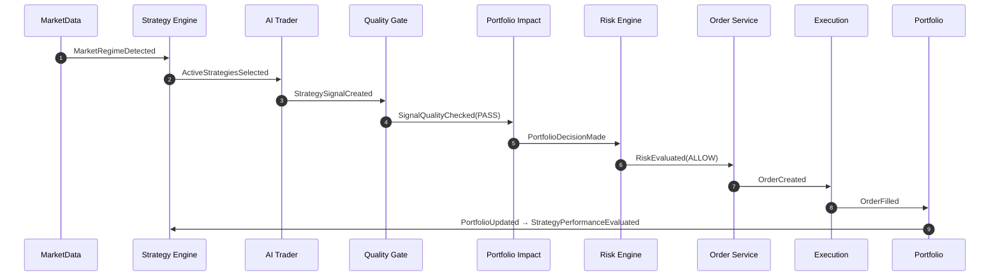

# EVENT_FLOW — 이벤트 흐름

> 컴포넌트 간 비동기 이벤트와 페이로드, correlationId 전파를 정의한다.
> (구현은 메시지 버스 또는 트랜잭셔널 아웃박스 기반을 권장한다.)

관련: [END_TO_END_FLOW](END_TO_END_FLOW.md) · [DATA_MODEL](DATA_MODEL.md) · [OBSERVABILITY](OBSERVABILITY.md)

---

## 1. 이벤트 목록

| 이벤트 | 발행자 | 구독자 | 핵심 페이로드 |
| --- | --- | --- | --- |
| `MarketDataIngested` | Market Data | Regime, AI | symbol, asOf, qualityFlag |
| `MarketRegimeDetected` | Regime | Strategy Engine | marketRegime, asOf |
| `ActiveStrategiesSelected` | Strategy Engine | AI Trader | strategyIds, weights |
| `StrategySignalCreated` | AI Trader | Quality Gate, Audit | strategySignalId, signalType, symbol, confidence |
| `SignalQualityChecked` | Quality Gate | Portfolio Impact | strategySignalId, result |
| `PortfolioDecisionMade` | Portfolio Impact | Risk Engine | portfolioDecisionId, expectedPct |
| `RiskEvaluated` | Risk Engine | Order Service, Audit | result(ALLOW/PENDING/REJECT), violations |
| `OrderCreated` | Order Service | Execution, Audit | orderId, status=CREATED |
| `OrderApprovalRequested` | Order Service | Notifier | orderId, reason |
| `OrderApproved` | Admin/Policy | Execution | orderId |
| `OrderSubmitted` | Execution | Audit, Obs | orderId, status=SUBMITTED |
| `OrderFilled` / `OrderPartiallyFilled` | Execution | Portfolio, Perf | orderId, filledQty, avgPrice |
| `OrderFailed` / `OrderRejected` | Execution/Risk | Notifier, Audit | orderId, reason |
| `PortfolioUpdated` | Portfolio | Strategy Perf, Obs | positions, pnl |
| `StrategyPerformanceEvaluated` | Strategy Perf | Strategy Engine | metrics |
| `StrategyDeactivated` | Strategy Engine | Notifier, Audit | strategyId, reason |
| `KillSwitchActivated` / `KillSwitchReleased` | Risk/Ops | all, Notifier | scope, reason, actor |
| `DataIngestionFailed` | Market Data | Notifier, Risk | source, asOf |

모든 이벤트는 `correlationId`, `eventId`, `occurredAt`을 포함한다.

---

## 2. 이벤트 시퀀스 (Mermaid)

---

## 3. 전달 보장 / 순서

- **최소 1회 전달(at-least-once)** + 소비자 멱등 처리(eventId/idempotencyKey).
- 주문 관련 이벤트는 **순서 보장**이 중요 → 동일 orderId는 순차 처리.
- 발행은 트랜잭셔널 아웃박스로 DB 커밋과 원자적으로 처리(유실 방지).

---

## 4. 실패/보상

| 상황 | 처리 |
| --- | --- |
| 소비 실패 | 재시도 큐 → DLQ(데드레터) → 알림 |
| 중복 소비 | eventId 기반 멱등 무시 |
| 주문 이벤트 유실 의심 | 증권사 상태 조회로 재동기화([FAILURE_AND_RECOVERY](FAILURE_AND_RECOVERY.md)) |

---

## 5. 감사 연동

`RiskEvaluated`, `Order*`, `KillSwitch*`, `StrategyDeactivated`는 감사 로그에 동기 기록한다.
