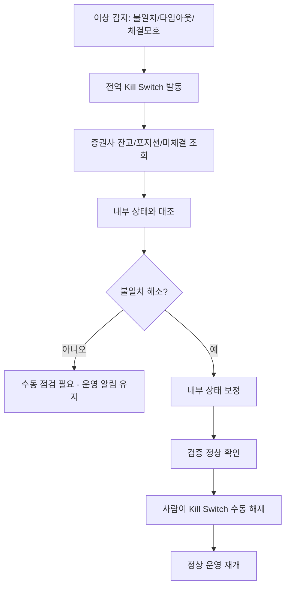

# FAILURE_AND_RECOVERY — 장애 및 복구

> 외부 API 장애, 부분 체결, 잔고 불일치, Kill Switch, 복구 절차를 정의한다.
> 원칙: **불확실하면 멈춘다(fail-safe).** 상태가 불명확하면 신규 주문을 차단하고 재동기화 후 재개한다.

관련: [ORDER_LIFECYCLE](ORDER_LIFECYCLE.md) · [RISK_ENGINE_RULES](RISK_ENGINE_RULES.md) ·
[OBSERVABILITY](OBSERVABILITY.md) · [DATA_MODEL](DATA_MODEL.md)

---

## 1. 외부 API 장애 유형별 처리

| 유형 | 증상 | 처리 |
| --- | --- | --- |
| **Timeout** | 응답 지연 초과 | 전송 결과 불명 → **즉시 재전송 금지**. 주문 상태를 `FAILED`로 두고 **주문 조회 API로 실제 접수 여부 확인** 후 결정 |
| **중복 응답** | 동일 주문 다중 응답 | 멱등키로 1건만 반영, 나머지 무시(로그) |
| **부분 체결** | 일부만 체결 | `PARTIALLY_FILLED`, 잔량 정책(대기/취소), 체결분 즉시 포트폴리오 반영 |
| **주문 거부** | 증권사 거부 응답 | `FAILED`/`REJECTED` 기록, 사유 분류, 알림. 자동 재시도 금지 |
| **네트워크 장애** | 연결 실패 | 서킷브레이커 open, 신규 전송 보류, 상태 조회 기반 복구 |
| **잔고 불일치** | 내부≠증권사 | **Kill Switch(전역) 발동**, 신규 주문 차단, 재동기화 후 수동 해제 |
| **API 인증 실패** | 토큰 만료/거부 | 토큰 회전 시도, 실패 시 차단 + 즉시 알림 |

### 1.1 타임아웃 황금 규칙

> 타임아웃은 "실패"가 아니라 **"결과 불명"** 이다.
> 절대 같은 주문을 맹목 재전송하지 않는다. 먼저 **주문 조회**로 접수/체결 여부를 확인한다.
> 조회도 불가하면 보수적으로 미체결 가정하지 말고, 상태 확정 전까지 동일 종목 신규 주문을 보류한다.

---

## 2. 재시도 정책

| 작업 | 재시도 |
| --- | --- |
| 조회(잔고/주문상태) | 지수 백오프, 제한 횟수, 멱등 안전 |
| 주문 전송 | **자동 재시도 금지**(중복 위험). 멱등키로만 안전 재시도 |
| 토큰 갱신 | 만료 전 선제 회전, 실패 시 차단 |

모든 외부 호출에 타임아웃·서킷브레이커를 적용한다(무한 재시도 금지).

---

## 3. 잔고/상태 재동기화

- 재동기화는 **증권사 상태를 신뢰원본(source of truth)** 으로 삼아 내부를 보정한다.
- 자동 해제는 금지한다. 사람이 확인 후 해제한다.

---

## 4. Kill Switch

| 종류 | 트리거(자동) | 해제 |
| --- | --- | --- |
| Global | 일일 손실 한도, 잔고 불일치, 주문 실패율 급증, 데이터 피드 중단, 인증 실패 | 수동 |
| Strategy | 전략 MDD 초과, 연속 손실, 신호 이상 | 수동/재검증 후 |
| Symbol | 종목 정지/이벤트/이상 | 수동 |

- ON 시 신규 진입 전면 차단. 청산성 주문 허용은 정책 플래그(기본 수동 승인).
- 모든 발동/해제는 감사 로그 + 알림.

---

## 5. 복구 체크리스트

- [ ] 이상 원인 분류(네트워크/인증/데이터/잔고/전략)
- [ ] 증권사 실제 상태 조회로 주문/포지션 확정
- [ ] 내부 상태 보정 및 미체결/부분체결 정리
- [ ] 중복 주문 여부 점검(멱등 로그)
- [ ] 데이터 피드 정상화 확인
- [ ] 한도/모드 안전값 확인 후 Kill Switch 수동 해제
- [ ] 사후 기록(타임라인, 영향 범위, 재발 방지)

---

## 6. 데이터 수집 실패 처리

- 피드 지연/결측 시 신호 품질 게이트가 `STALE_DATA`로 보류/폐기.
- 지속 실패 시 해당 종목/전략 비활성화 또는 전역 보류.
- 데이터 품질 메트릭과 알림은 [OBSERVABILITY](OBSERVABILITY.md) 참조.
