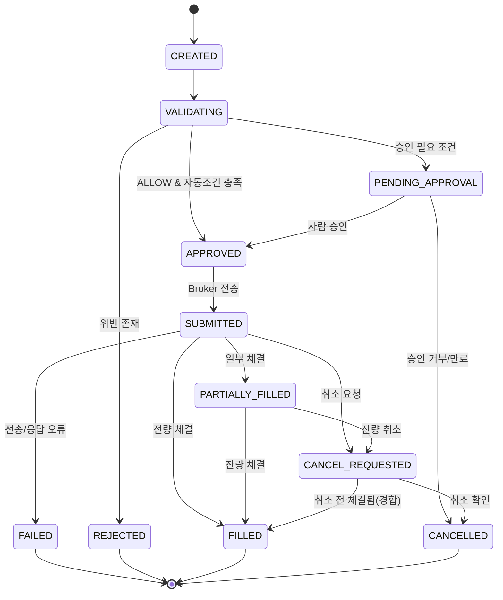

# ORDER_LIFECYCLE — 주문 생명주기

> 주문의 상태 정의, 상태 전이, 멱등성, 부분 체결 처리를 정의한다.

관련: [RISK_ENGINE_RULES](RISK_ENGINE_RULES.md) · [FAILURE_AND_RECOVERY](FAILURE_AND_RECOVERY.md) ·
[COMPONENT_RESPONSIBILITIES](COMPONENT_RESPONSIBILITIES.md) · [DATA_MODEL](DATA_MODEL.md)

---

## 1. 주문 상태 정의

| 상태 | 의미 |
| --- | --- |
| `CREATED` | 주문 후보가 주문으로 생성됨(아직 미검증/미전송) |
| `VALIDATING` | Risk Engine + Order Policy 검증 중 |
| `REJECTED` | 검증 실패로 거절(전송 안 함) |
| `APPROVED` | 검증 통과, 자동 전송 대상 |
| `PENDING_APPROVAL` | 사람 승인 대기(SEMI_AUTO/조건부) |
| `SUBMITTED` | 증권사로 전송됨(접수 대기/접수됨) |
| `PARTIALLY_FILLED` | 일부 수량 체결 |
| `FILLED` | 전량 체결 |
| `CANCEL_REQUESTED` | 취소 요청 전송됨 |
| `CANCELLED` | 취소 완료 |
| `FAILED` | 전송/처리 실패(네트워크/오류/타임아웃) |

---

## 2. 상태 전이 다이어그램 (Mermaid)

### 2.1 전이 규칙

- `REJECTED`/`PENDING_APPROVAL` 상태에서는 **절대 증권사로 전송하지 않는다.**
- `SUBMITTED` 이후 상태는 **증권사 응답/체결 동기화**로만 갱신한다(임의 변경 금지).
- `CANCEL_REQUESTED` 중 체결될 수 있으므로(경합) 취소 확인 전까지 체결 가능성을 가정한다.

---

## 3. 멱등성

- 주문 생성은 `candidateId` 기반 **멱등키**로 1회만 생성한다(중복 방지).
- 전송도 멱등 처리: 재시도 시 동일 멱등키로 **중복 주문이 생성되지 않도록** 한다.
- Redis로 멱등키·중복·빈도를 판정한다.

---

## 4. 부분 체결 처리

| 상황 | 처리 |
| --- | --- |
| 일부 체결 후 잔량 존재 | `PARTIALLY_FILLED` 유지, 잔량 추적 |
| 잔량 정책: 추가 대기 | 유효시간 내 체결 대기 |
| 잔량 정책: 취소 | `CANCEL_REQUESTED` → `CANCELLED` |
| 부분 체결 분량 | 즉시 포트폴리오 반영(실제 보유 기준) |

부분 체결 수량·평균가는 체결 이벤트마다 누적 기록한다.

---

## 5. 주문 결과 저장 원칙

- 주문/체결(`order`, `order_execution`)은 **신호와 분리 저장**한다.
- 각 레코드는 `correlationId`, `orderId`, `strategySignalId`, `portfolioDecisionId`를 포함한다.
- 증권사 응답 원문은 민감 필드를 제거/마스킹 후 보관한다.

---

## 6. 거래 모드별 동작

| 모드 | CREATED 이후 |
| --- | --- |
| PAPER | 가상 체결로 FILLED/PARTIALLY_FILLED 시뮬레이션 |
| SEMI_AUTO | ALLOW여도 `PENDING_APPROVAL` → 승인 후 SUBMITTED |
| AUTO | 자동 조건 충족 시 APPROVED → SUBMITTED, 아니면 PENDING_APPROVAL |
