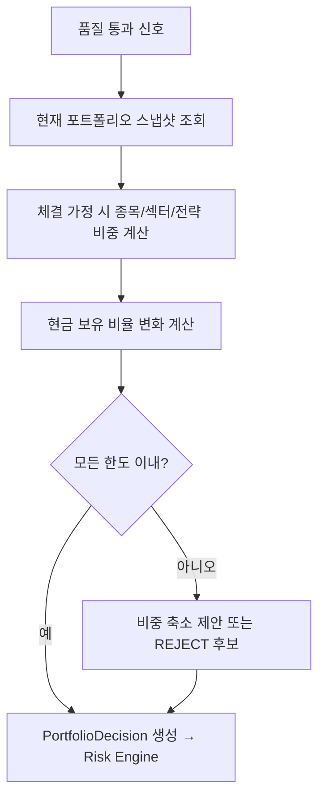

# PORTFOLIO_MANAGEMENT_RULES — 포트폴리오 관리 규칙

> 비중 한도, 현금 보유, 손절/익절, 리밸런싱 기준을 정의한다.
> 포트폴리오 영향 분석(7단계)과 Risk Engine 비중 검증의 기준이 된다.

관련: [RISK_ENGINE_RULES](RISK_ENGINE_RULES.md) · [STRATEGY_SELECTION_FLOW](STRATEGY_SELECTION_FLOW.md) ·
[END_TO_END_FLOW](END_TO_END_FLOW.md)

---

## 1. 포트폴리오 영향 분석 (Portfolio Impact)

신호가 주문이 되기 전, 이 주문이 체결되면 포트폴리오가 어떻게 변하는지 **사후(post-trade) 예상치**를 계산한다.

---

## 2. 비중 한도

| 한도 | 기본값(예시) | 설명 |
| --- | --- | --- |
| 종목별 최대 비중 | 10% | 단일 종목 평가금액 / 포트폴리오 |
| 섹터별 최대 비중 | 30% | 단일 섹터 합계 |
| 전략별 최대 비중 | 25% | 단일 전략 할당 합계 |
| 현금 최소 보유 비율 | 10% | 항상 유지할 최소 현금 |

- 비중은 (보유 평가금액 + 주문가능 현금) 기준으로 계산한다.
- 매수/신규 진입은 한도를 엄격히 적용한다. 위험 축소(청산)는 완화 가능.
- 전략 간 상관관계가 높으면 합산 비중을 추가 제한한다.

> 수치는 예시이며, 단일 기준은 기존 위험 관리 정책(RISK_POLICY)/`.env`와 일치시킨다.

---

## 3. 손절 / 익절 기준

| 항목 | 규칙 |
| --- | --- |
| 손절(Stop Loss) | 신호의 `stopLossPrice` 또는 종목별 최대 허용 손실률 도달 시 청산 |
| 익절(Take Profit) | 신호의 `takeProfitPrice` 도달 시 전량/부분 청산 |
| 트레일링(선택) | 고점 대비 일정% 하락 시 청산(전략별 옵션) |
| 시간 기반 청산 | `holdingPeriod`/`validUntil` 경과 시 재평가/청산 |

- 손절은 **강제**한다. 손절 미설정 신호는 품질 게이트에서 보완 또는 거절한다.
- 청산성 주문은 Kill Switch ON 상황에서도 정책 플래그에 따라 허용될 수 있다(기본 수동 승인).

---

## 4. 리밸런싱 기준

| 트리거 | 설명 |
| --- | --- |
| 임계 이탈(drift) | 목표 비중 대비 ±임계%(예: ±5%p) 이탈 시 |
| 주기 | 정기(예: 주간/월간) 점검 |
| 국면 전환 | marketRegime 변경 시 전략·비중 재배분 |
| 전략 비활성화 | 비활성 전략 비중을 회수·재배분 |

- 리밸런싱 주문도 **Risk Engine 검증을 동일하게** 통과해야 한다.
- 과도한 회전을 막기 위해 최소 거래 단위·거래비용을 고려한다(밴드 방식 권장).

---

## 5. 포트폴리오 위험 우선 원칙

- 개별 종목 기대수익보다 **포트폴리오 전체 위험**(집중도·상관·MDD)을 우선한다.
- 신규 매수가 분산을 악화시키면 비중을 축소하거나 거절한다.
- 현금 최소 보유 비율은 어떤 경우에도 침범하지 않는다(유동성·방어).

---

## 6. 손익 갱신

- 체결 시 실제 보유 기준으로 포지션·평가손익·비중을 즉시 갱신한다(부분 체결 포함).
- 일일 손익은 실현+평가를 합산해 한도 모니터링에 사용한다([RISK_ENGINE_RULES](RISK_ENGINE_RULES.md)).
- 갱신 결과는 전략 성과 평가로 전달된다([STRATEGY_SELECTION_FLOW](STRATEGY_SELECTION_FLOW.md)).
