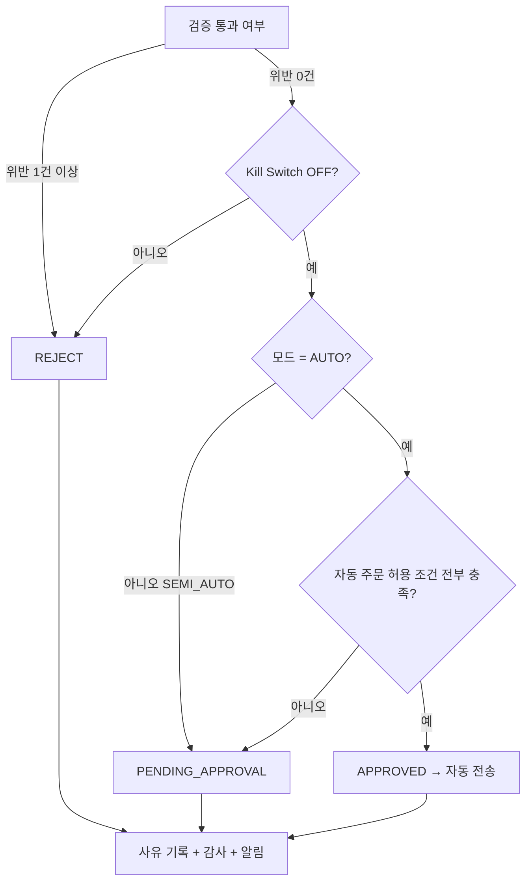

# RISK_ENGINE_RULES — Risk Engine 검증 규칙

> 본 문서는 흐름 관점의 검증 규칙과 **자동/승인/거절 판정**을 정의한다.
> 한도 수치의 단일 기준은 기존 위험 관리 정책(RISK_POLICY)을 따른다.

관련: [END_TO_END_FLOW](END_TO_END_FLOW.md) · [ORDER_LIFECYCLE](ORDER_LIFECYCLE.md) ·
[PORTFOLIO_MANAGEMENT_RULES](PORTFOLIO_MANAGEMENT_RULES.md) · [FAILURE_AND_RECOVERY](FAILURE_AND_RECOVERY.md)

---

## 1. 검증 파이프라인

신호는 품질 검증·포트폴리오 영향 분석을 거친 뒤 Risk Engine에 도달한다.
아래 순서로 검증하며, **하나라도 실패하면 즉시 REJECT** 하고 사유를 기록한다.

```
0. Kill Switch (전역/전략/종목)  → ON 이면 REJECT
1. 거래 가능 시간
2. 종목 상태(정지/관리/급등락/유동성 부족)
3. 잔고/주문 가능 금액
4. 1회 최대 주문 금액
5. 종목별 최대 비중(사후 예상)
6. 섹터별 최대 비중(사후 예상)
7. 전략별 최대 비중(사후 예상)
8. 일일 최대 주문 금액
9. 일일 최대 손실 한도
10. 최대 허용 손실률
11. 현금 최소 보유 비율
12. 중복 주문
13. 주문 빈도 제한
14. 신호 유효성(만료/신뢰도)
→ 전부 통과 시 판정 단계로
```

---

## 2. 판정: 자동 / 승인 대기 / 거절



### 2.1 자동 주문 허용 조건(요약)

- 모드 AUTO + 전략 AUTO 승격, Kill Switch 전부 OFF
- 위반 0건, `confidenceScore ≥ 자동 임계`, 신호 미만료
- 주문 금액이 1회/일일 한도 및 **자동 실행 상한(소액) 이내**
- 종목/섹터/전략 비중 사후 예상이 한도 이내, 잔고 충분
- 종목 정상·거래 가능 시간, 중복/빈도 정상, 데이터 품질 정상

전체 목록: [END_TO_END_FLOW](END_TO_END_FLOW.md) 6.4

### 2.2 승인 전환 조건(요약)

- 모드 SEMI_AUTO, 고액 주문(자동 상한 초과), 경계 신뢰도/경계 비중
- `riskFlags` 주의 항목, 데이터 품질 경고, 일일 손실 한도 임계 도달
- 신규 AUTO 전략/Kill Switch 해제 직후 관찰 기간

전체 목록: [END_TO_END_FLOW](END_TO_END_FLOW.md) 6.5

---

## 3. 위반 코드

`MAX_ORDER_AMOUNT, MAX_DAILY_ORDER_AMOUNT, MAX_DAILY_LOSS, MAX_LOSS_PCT,
MAX_POSITION_PCT, MAX_SECTOR_PCT, MAX_STRATEGY_PCT, MIN_CASH_RESERVE,
DUPLICATE_ORDER, RATE_LIMIT, INSUFFICIENT_BALANCE, MARKET_CLOSED,
HALTED_SYMBOL, ILLIQUID_OR_VOLATILE, SIGNAL_EXPIRED, LOW_CONFIDENCE, KILL_SWITCH`

각 위반은 `{ rule, limit, actual }` 형태로 `riskEvaluation`에 저장한다.

---

## 4. 비중 검증 기준

- 비중은 **사후(post-trade) 예상치**로 검증한다(이 주문 체결 시 한도 초과 여부).
- 위험 축소(청산/손절) 주문은 한도 검증을 완화할 수 있다(리스크 감소 방향).
- 매수/신규 진입은 엄격히 적용한다.

---

## 5. Kill Switch 연동

- 전역 ON: 모든 신규 진입 REJECT.
- 전략 ON: 해당 전략 신호 REJECT.
- 종목 ON: 해당 종목 신규 진입 REJECT.
- 청산성 주문 허용 여부는 정책 플래그로 통제(기본 수동 승인).
- 발동/해제는 감사 로그 + 알림. 해제는 사람만 가능(자동 해제 금지).

---

## 6. 테스트 요구사항

- 각 위반 코드별 통과/경계/초과 테스트.
- 자동/승인/거절 분기 전수 테스트.
- Kill Switch ON 시 매수 REJECT, 일일 손실 한도 도달 후 신규 매수 차단.
- 멱등/중복/빈도 동시성 테스트(Redis).
