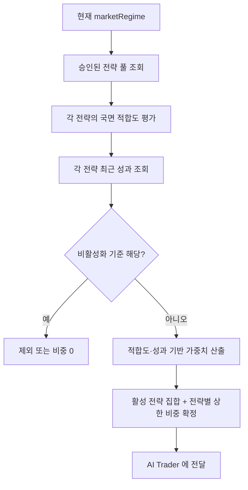
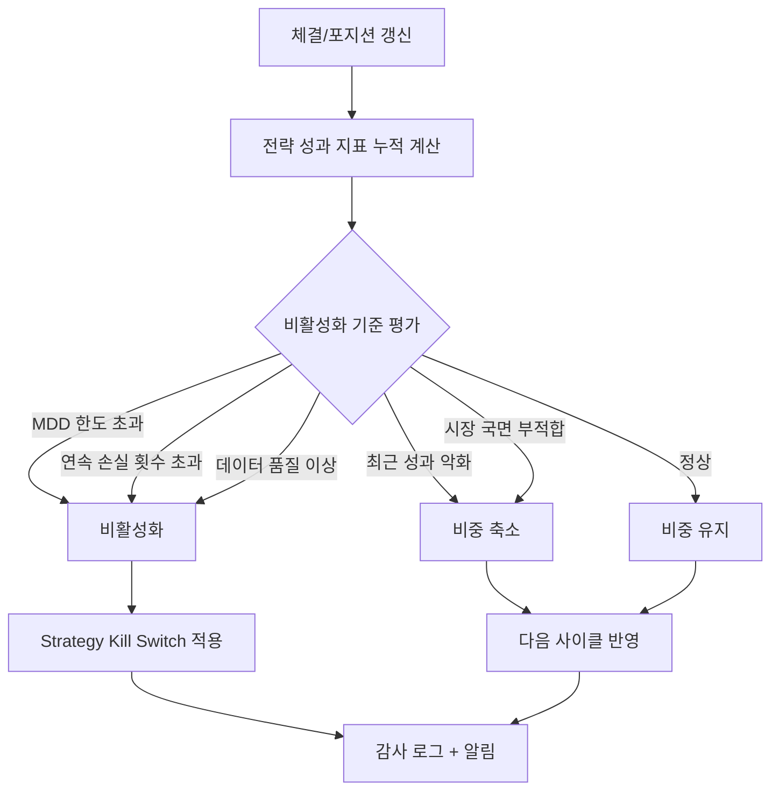

# STRATEGY_SELECTION_FLOW — 전략 선택 및 성과 평가

> 시장 국면 판단 → 활성 전략 선택 → 성과 평가 → 비중 조정/중단까지의 운영 흐름을 정의한다.

관련: [AI_TRADER_FLOW](AI_TRADER_FLOW.md) · [PORTFOLIO_MANAGEMENT_RULES](PORTFOLIO_MANAGEMENT_RULES.md) ·
[RISK_ENGINE_RULES](RISK_ENGINE_RULES.md) · [END_TO_END_FLOW](END_TO_END_FLOW.md)

---

## 1. 시장 국면 판단

| 국면(marketRegime) | 특징 | 적합 전략 예시 |
| --- | --- | --- |
| BULL(상승) | 추세 상승, 변동성 보통 | 모멘텀/추세추종 |
| BEAR(하락) | 추세 하락 | 방어/현금 비중 확대/숏 회피 |
| SIDEWAYS(횡보) | 박스권 | 평균회귀 |
| HIGH_VOLATILITY(고변동성) | 큰 진폭 | 변동성 축소·비중 축소 |
| EVENT(이벤트) | 공시/실적/거시 이벤트 | 이벤트 드리븐(보수적) |

국면 판단은 지수·변동성·지표·이벤트 정보를 종합하며, 판단 근거와 시점을 기록한다.

---

## 2. 활성 전략 선택 (Mermaid)

- AI는 **승인된 전략 풀 내에서만** 선택한다(즉흥 전략 생성 금지).
- 전략 등록·승격·중단의 거버넌스는 기존 전략 거버넌스 정책을 따른다.

---

## 3. 전략별 성과 지표

| 지표 | 설명 |
| --- | --- |
| 누적 수익률(Cumulative Return) | 기간 누적 손익률 |
| 최대 낙폭(MDD) | 고점 대비 최대 하락폭 |
| 승률(Win Rate) | 이익 거래 비율 |
| 손익비(Profit Factor / Payoff) | 총이익 / 총손실 또는 평균이익/평균손실 |
| 샤프 비율(또는 대체) | 위험 조정 수익. 표본 부족 시 Sortino/Calmar로 대체 |
| 거래 횟수(Trade Count) | 표본 수(통계적 유의성 판단) |
| 거래비용 반영 수익률 | 수수료·세금·슬리피지 차감 후 순수익률 |

> 성과는 **반드시 거래비용 반영 기준**으로 평가한다. 비용 미반영 수익률은 참고용일 뿐 판정 근거가 아니다.

---

## 4. 전략 성과 평가 및 비활성화 흐름 (Mermaid)

---

## 5. 전략 비활성화 기준

| 기준 | 설명 | 조치 |
| --- | --- | --- |
| 최대 낙폭 초과 | MDD가 전략 riskProfile 한도 초과 | 즉시 비활성화 |
| 연속 손실 횟수 초과 | 연속 N회 손실(전략별 설정) | 비활성화 또는 비중 0 |
| 최근 성과 악화 | 최근 구간 수익률/샤프 급락 | 비중 축소 → 지속 시 중단 |
| 시장 국면 부적합 | 현재 국면과 전략 targetRegime 불일치 | 비중 축소/제외 |
| 데이터 품질 이상 | 입력 결측·지연·이상치 | 즉시 비활성화(안전 우선) |

- 비활성화/축소/복귀는 모두 **감사 로그**에 기록하고 운영 알림을 발생시킨다.
- 비활성화된 전략의 재개는 재검증(백테스트/페이퍼) 후에만 가능하다.

---

## 6. 비중 조정 원칙

- 전략별 상한 비중은 [PORTFOLIO_MANAGEMENT_RULES](PORTFOLIO_MANAGEMENT_RULES.md)를 따른다.
- 성과 악화 전략은 단계적으로 비중을 줄이고(예: 50% → 0), 회복 시 점진 복귀한다.
- 전략 간 상관관계가 높으면 합산 비중을 제한해 분산을 유지한다.
